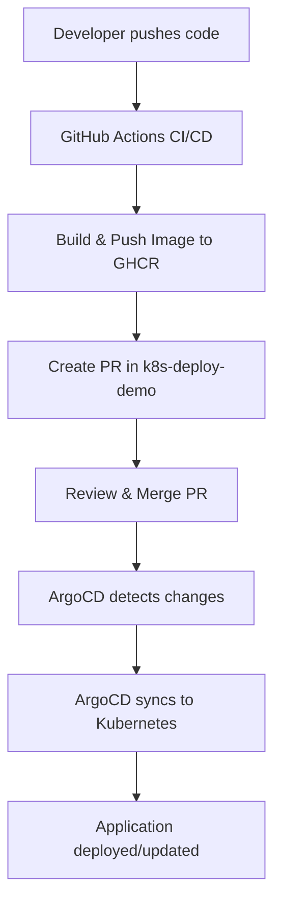

# K8s Deploy Demo

GitOps deployment repository for the [k8s-demo](https://github.com/hustshawn/k8s-demo) application using Kustomize and ArgoCD for automated Kubernetes deployments.

## 🎯 Purpose

This repository contains Kubernetes deployment manifests and follows GitOps principles where:
- **Declarative Configuration**: All deployment configs are stored as code
- **Version Controlled**: Every change is tracked and auditable
- **Automated Deployment**: ArgoCD monitors this repo and applies changes automatically
- **Separation of Concerns**: Application code and deployment configs are separate

## 📁 Repository Structure

```
k8s-deploy-demo/
├── deployment.yaml      # Kubernetes Deployment manifest
├── service.yaml         # Kubernetes Service manifest
├── kustomization.yaml   # Kustomize configuration with image overrides
└── README.md           # This file
```

## 🏗️ GitOps Workflow



## 📋 Kubernetes Resources

### Deployment (`deployment.yaml`)

```yaml
apiVersion: apps/v1
kind: Deployment
metadata:
  name: backend-app
  namespace: default
spec:
  selector:
    matchLabels:
      app: backend
  template:
    spec:
      containers:
      - name: backend
        image: ghcr.io/hustshawn/k8s-demo  # Tag managed by Kustomize
        ports:
        - containerPort: 8080
        resources:
          requests:
            cpu: 250m
            memory: 512Mi
          limits:
            cpu: 500m
            memory: 512Mi
```

### Service (`service.yaml`)

```yaml
apiVersion: v1
kind: Service
metadata:
  name: backend-service
  namespace: default
spec:
  selector:
    app: backend
  ports:
  - port: 80
    targetPort: 8080
  type: ClusterIP
```

### Kustomize Configuration (`kustomization.yaml`)

```yaml
resources:
- deployment.yaml
- service.yaml

images:
- name: ghcr.io/hustshawn/k8s-demo
  newTag: main  # Automatically updated by CI/CD pipeline
```

## 🔄 Image Tag Management

### Automated Updates

The CI/CD pipeline from [k8s-demo](https://github.com/hustshawn/k8s-demo) automatically:

1. **Builds new image** with timestamp tag (e.g., `20250708-160000`)
2. **Creates PR** in this repository
3. **Updates `kustomization.yaml`** with new image tag
4. **Provides detailed PR description** with change information

### Manual Updates

You can also manually update the image tag:

```bash
# Edit kustomization.yaml
sed -i 's/newTag: .*/newTag: 20250708-160000/' kustomization.yaml

# Commit and push
git add kustomization.yaml
git commit -m "Update image tag to 20250708-160000"
git push origin main
```

## 🚀 Deployment

### Using Kustomize

```bash
# Apply directly with kubectl
kubectl apply -k .

# Or build and review first
kubectl kustomize . | kubectl apply -f -
```

### Using ArgoCD

```bash
# Create ArgoCD application
argocd app create k8s-demo \
  --repo https://github.com/hustshawn/k8s-deploy-demo \
  --path . \
  --dest-server https://kubernetes.default.svc \
  --dest-namespace default \
  --sync-policy automated \
  --auto-prune \
  --self-heal

# Sync application
argocd app sync k8s-demo
```

## 📊 Monitoring Deployments

### Check Deployment Status

```bash
# Check pods
kubectl get pods -l app=backend

# Check deployment
kubectl get deployment backend-app

# Check service
kubectl get service backend-service

# View logs
kubectl logs -l app=backend -f
```

### ArgoCD Monitoring

```bash
# Check application status
argocd app get k8s-demo

# View application in UI
argocd app open k8s-demo
```

## 🔧 Configuration Management

### Environment-Specific Deployments

To support multiple environments, you can create overlays:

```
k8s-deploy-demo/
├── base/
│   ├── deployment.yaml
│   ├── service.yaml
│   └── kustomization.yaml
├── overlays/
│   ├── development/
│   │   └── kustomization.yaml
│   ├── staging/
│   │   └── kustomization.yaml
│   └── production/
│       └── kustomization.yaml
```

### Resource Customization

Modify resources using Kustomize patches:

```yaml
# kustomization.yaml
patchesStrategicMerge:
- resource-patch.yaml

patchesJson6902:
- target:
    version: v1
    kind: Deployment
    name: backend-app
  patch: |-
    - op: replace
      path: /spec/replicas
      value: 3
```

## 🔐 Security Considerations

### Image Security

- **Registry**: Uses GitHub Container Registry (GHCR) with authentication
- **Image Scanning**: Automated vulnerability scanning in CI/CD
- **Tag Immutability**: Uses specific timestamp tags instead of `latest`

### Kubernetes Security

- **Resource Limits**: CPU and memory limits defined
- **Non-root User**: Container runs as non-root user
- **Network Policies**: Consider adding network policies for production
- **RBAC**: ArgoCD uses service account with appropriate permissions

## 🚦 Health Checks

### Application Health

```yaml
# Liveness probe
livenessProbe:
  httpGet:
    path: /health
    port: 8080
  initialDelaySeconds: 30
  periodSeconds: 10

# Readiness probe
readinessProbe:
  httpGet:
    path: /health
    port: 8080
  initialDelaySeconds: 5
  periodSeconds: 5
```

### Deployment Health

```bash
# Check rollout status
kubectl rollout status deployment/backend-app

# Check pod health
kubectl describe pod -l app=backend
```

## 🔄 Rollback Procedures

### Using kubectl

```bash
# View rollout history
kubectl rollout history deployment/backend-app

# Rollback to previous version
kubectl rollout undo deployment/backend-app

# Rollback to specific revision
kubectl rollout undo deployment/backend-app --to-revision=2
```

### Using ArgoCD

```bash
# Rollback to previous sync
argocd app rollback k8s-demo

# Rollback to specific revision
argocd app rollback k8s-demo --revision 5
```

### Using Git

```bash
# Revert to previous image tag
git revert HEAD
git push origin main
# ArgoCD will automatically sync the rollback
```

## 🐛 Troubleshooting

### Common Issues

1. **Image Pull Errors**
   ```bash
   # Check image exists
   docker pull ghcr.io/hustshawn/k8s-demo:TAG
   
   # Check image pull secrets
   kubectl get secrets
   ```

2. **Pod Startup Issues**
   ```bash
   # Check pod events
   kubectl describe pod POD_NAME
   
   # Check logs
   kubectl logs POD_NAME
   ```

3. **Service Connectivity**
   ```bash
   # Test service endpoint
   kubectl port-forward service/backend-service 8080:80
   curl http://localhost:8080
   ```

4. **ArgoCD Sync Issues**
   ```bash
   # Force refresh
   argocd app refresh k8s-demo
   
   # Hard refresh
   argocd app refresh k8s-demo --hard
   ```

### Useful Commands

```bash
# View all resources
kubectl get all -l app=backend

# Check resource usage
kubectl top pods -l app=backend

# Debug networking
kubectl exec -it POD_NAME -- /bin/sh

# View Kustomize output
kubectl kustomize .
```

## 📈 Scaling

### Manual Scaling

```bash
# Scale deployment
kubectl scale deployment backend-app --replicas=3
```

### Horizontal Pod Autoscaler

```yaml
apiVersion: autoscaling/v2
kind: HorizontalPodAutoscaler
metadata:
  name: backend-hpa
spec:
  scaleTargetRef:
    apiVersion: apps/v1
    kind: Deployment
    name: backend-app
  minReplicas: 2
  maxReplicas: 10
  metrics:
  - type: Resource
    resource:
      name: cpu
      target:
        type: Utilization
        averageUtilization: 70
```

## 🔗 Related Resources

- **Source Repository**: [k8s-demo](https://github.com/hustshawn/k8s-demo)
- **Container Images**: [GHCR Package](https://github.com/hustshawn/k8s-demo/pkgs/container/k8s-demo)
- **Kustomize Documentation**: [kustomize.io](https://kustomize.io/)
- **ArgoCD Documentation**: [argoproj.github.io](https://argoproj.github.io/argo-cd/)

## 🤝 Contributing

### Making Changes

1. **For application changes**: Modify the [k8s-demo](https://github.com/hustshawn/k8s-demo) repository
2. **For deployment changes**: 
   - Fork this repository
   - Make changes to manifests
   - Test with `kubectl kustomize .`
   - Create Pull Request
   - ArgoCD will sync after merge

### Testing Changes

```bash
# Validate Kubernetes manifests
kubectl kustomize . | kubectl apply --dry-run=client -f -

# Validate with kubeval (if installed)
kubectl kustomize . | kubeval

# Test in development environment
kubectl apply -k . --namespace=development
```

## 📄 License

This project is licensed under the MIT License - see the [LICENSE](LICENSE) file for details.

## 🏷️ Tags

`kubernetes` `gitops` `argocd` `kustomize` `deployment` `ci-cd` `docker` `containers`

---

**🚀 Automated deployments made simple with GitOps**
